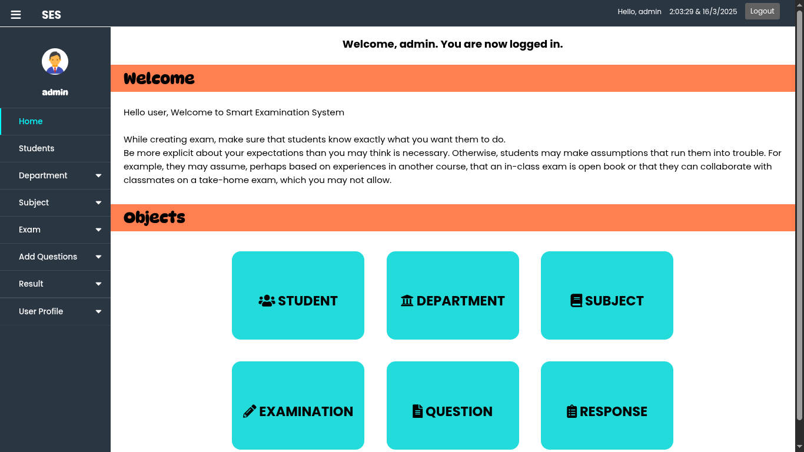

# Smart Examination System

This Online Examination System is designed to streamline and simplify the process of conducting examinations for both Students and Faculty. It provides a secure, efficient, and user-friendly platform to manage all aspects of the examination lifecycle. The system supports three distinct user roles:

- **Superuser (Admin)**: Oversees the entire system, manages users, and ensures smooth operation.  
- **Faculty**: Facilitates the creation, management, and evaluation of exams.  
- **Students**: Participates in exams and receives instant results, fostering a seamless examination experience.

By leveraging advanced features like automatic submission, tab restriction, and secure login mechanisms, this system ensures a fair and efficient examination process while reducing administrative overhead.

1. **Superuser (Admin)**: Responsible for all activities in the system. Admins can manage all users and the system. [django Admin Portal UI]
2. **Faculty**: Responsible for managing exams in the system.  
3. **Students**: Can appear for exams, and results will be generated automatically based on their performance.

## Key Features

- **Automatic Submission**: Exam papers are auto-submitted after the time limit.  
- **Automatic Marks Calculation**: Marks for Multiple Choice Questions (MCQs) and coding exams are calculated automatically.  
- **Subjective Questions**: For subjective questions, three faculty members evaluate the paper, and the system calculates the average marks.  
- **Tab Restriction**: Students cannot switch tabs during the exam. If they do, the form is auto-submitted, and faculties are notified.  
- **Secure Framework**: Built using the Django framework, ensuring high security.

---

## System Users

1. **Admin**  
2. **Professor**  
3. **Students**

---

## Modules

1. **Login**  
2. **Sign-up**  
3. **Exam**  
4. **Result**

### Module Descriptions

#### 1. Login  
- Secure login with username and password.  
- All login details are tracked for security purposes.  

#### 2. Sign-up  
- Students can register themselves using the sign-up feature.  
- Faculty registration is managed by the admin.  

#### 3. Exam  
- Exams can be created and managed by faculty.  
- Only valid users can access the exams.  
- Exam papers can be edited as per requirements.  

#### 4. Result  
- Students can view detailed reports of their exam submissions.  
- A short description of the result is also provided.  
- Students can contact respective faculties for queries regarding paper evaluation.

---

## Technical Details

- **Framework**: Django (Python)  
- **Architecture**: Django MVC  
- **Purpose**: Educational (BCA Project)

---

## Screenshots

### Welcome Page
  

### Login Page


### Faculty Dashboard


### Student Dashboard


---


## How to Run the Project  
1. Clone the repository:  
     ```bash  
     git clone https://github.com/amankrs21/Smart-Examination.git  
     ```  
2. Navigate to the project directory:  
     ```bash  
     cd Smart-Examination  
     ```  
3. Install dependencies:  
     ```bash  
     pip install -r requirements.txt  
     ```  
4. Run the server:  
     ```bash  
     python manage.py runserver  
     ```  
5. Open the browser and visit:  
     ```  
     http://127.0.0.1:8000/  
     ```  

---

## License  
This project is for educational purposes only. 
